# Implementação de Autenticação Wi-Fi WPA2-Enterprise com pfSense e FreeRADIUS

## Visão Geral

Este projeto demonstra a implementação de autenticação centralizada para uma rede Wi-Fi utilizando WPA/WPA2-Enterprise (802.1X), com o FreeRADIUS integrado ao pfSense e um Access Point TP-Link WR829N operando em modo AP.

O objetivo é validar o processo de autenticação de usuários por meio de credenciais individuais, utilizando uma infraestrutura simples composta por hardware doméstico e software open source.

---

## Objetivos

* Implementar autenticação Wi-Fi baseada em usuário e senha.
* Integrar o FreeRADIUS ao pfSense.
* Configurar um Access Point para utilizar autenticação WPA2-Enterprise.
* Validar o fluxo completo de autenticação em ambiente de laboratório.

---

## Topologia

A topologia do laboratório é composta pelo pfSense atuando como roteador principal da rede, responsável pelo gerenciamento da LAN, fornecimento de DHCP e integração com um servidor RADIUS previamente configurado.

A rede LAN 192.168.1.0/24 é utilizada como segmento principal, onde o ponto de acesso TP-Link, configurado em modo Access Point e com endereço IP estático 192.168.1.4, atua como cliente RADIUS.

O TP-Link é responsável pela distribuição do sinal Wi-Fi aos dispositivos sem fio, enquanto a autenticação dos usuários é centralizada no pfSense por meio do serviço RADIUS, garantindo controle de acesso à rede.

Por fim, a interface WAN do pfSense fornece conectividade com a internet.

Figura 1 – Topologia da rede do laboratório

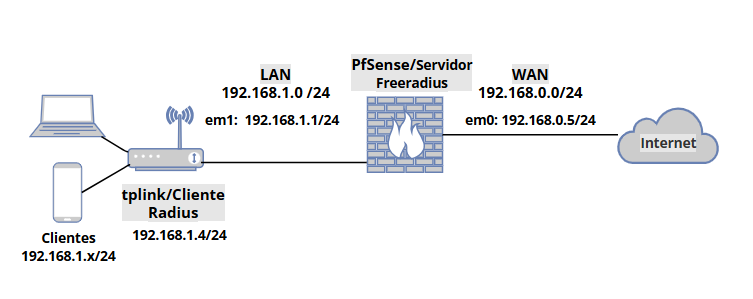

## Tecnologias Utilizadas

* pfSense
* FreeRADIUS
* WPA/WPA2-Enterprise (802.1X)
* TP-Link WR829N (Modo Access Point)

---

## Configurações

## Configuração do FreeRADIUS no pfSense

No pfSense, o serviço **FreeRADIUS** foi configurado como servidor de autenticação utilizando o protocolo **RADIUS**. Em seguida, o equipamento **TP-Link** foi cadastrado como um cliente RADIUS autorizado, permitindo que ele encaminhe solicitações de autenticação ao servidor.

### Endereçamento IP

| Dispositivo       | Função          | Endereço IP    |
| ----------------- | --------------- | -------------- |
| pfSense           | Servidor RADIUS | 192.168.1.1/24 |
| TP-Link (Modo AP) | Cliente RADIUS  | 192.168.1.4/24 |

### Cadastro do Cliente RADIUS

Foi adicionado no FreeRADIUS o Access Point TP-Link como cliente autorizado, utilizando o endereço IP **192.168.1.4**. Dessa forma, o equipamento pode enviar credenciais de autenticação para o servidor RADIUS e receber a resposta de autorização ou rejeição de acesso.

### Criação de Usuários

Para validação do funcionamento da autenticação, foram criados os seguintes usuários de teste:

* `user-teste1`
* `user-teste2`

Essas contas são utilizadas para autenticação dos dispositivos clientes conectados à rede sem fio.

### Configuração do Firewall

Para permitir a comunicação entre o Access Point e o servidor RADIUS, foi criada uma regra de firewall na interface **LAN** do pfSense com as seguintes características:

* **Origem:** 192.168.1.4 (TP-Link)
* **Destino:** 192.168.1.1 (Servidor FreeRADIUS)
* **Protocolo:** UDP
* **Porta de destino:** 1812

A porta **1812/UDP** é utilizada pelo protocolo RADIUS para autenticação e sua liberação é necessária para o correto funcionamento do processo de validação das credenciais dos usuários.

### Fluxo de Autenticação

1. O usuário tenta se conectar à rede Wi-Fi.
2. O Access Point TP-Link recebe as credenciais informadas.
3. O TP-Link encaminha a solicitação de autenticação ao servidor FreeRADIUS no pfSense através da porta **1812/UDP**.
4. O FreeRADIUS valida as credenciais cadastradas.
5. O servidor retorna uma resposta de **Access-Accept** (acesso permitido) ou **Access-Reject** (acesso negado).
6. O Access Point concede ou bloqueia o acesso à rede de acordo com a resposta recebida.

Figura 2 – Configuração de rede pfSense

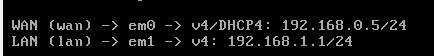

Figura 3 - Configuração do servidor freeRADIUS

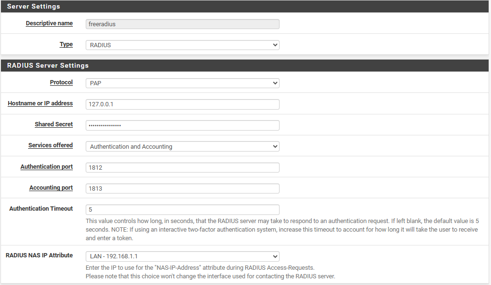

Figura 4 - Configuração do tplink como cliente FreeRADIUS

Figura 5 - Regra de firewall permitindo tráfego do protocolo RADIUS

## Configuração do Access Point TP-Link

A primeira etapa da configuração do equipamento TP-Link consistiu em defini-lo no modo **Access Point (AP)**. Nesse modo de operação, o dispositivo atua como uma ponte entre a rede cabeada e a rede sem fio, permitindo que dispositivos Wi-Fi acessem a infraestrutura de rede existente.

### Configuração de Rede

Após a alteração para o modo AP, foi configurado o endereço IP estático **192.168.1.4/24** para gerenciamento do equipamento.

O serviço **DHCP** do TP-Link foi desabilitado, uma vez que a distribuição de endereços IP da rede é realizada pelo pfSense, que atua como servidor DHCP principal.

### Configuração da Rede Sem Fio

Foi criada uma rede sem fio (SSID) denominada:

* **Rede-Lab-Teste**

Para garantir a autenticação centralizada dos usuários, o método de segurança selecionado foi **WPA/WPA2-Enterprise**, permitindo a integração com um servidor RADIUS externo.

### Integração com o Servidor FreeRADIUS

Nas configurações de autenticação da rede sem fio, foram definidos os seguintes parâmetros:

| Parâmetro             | Valor                                                                |
| --------------------- | -------------------------------------------------------------------- |
| Servidor RADIUS       | 192.168.1.1                                                          |
| Porta de Autenticação | 1812                                                                 |
| Shared Secret         | Senha configurada durante o cadastro do cliente RADIUS no FreeRADIUS |

O endereço IP **192.168.1.1** corresponde à interface LAN do pfSense, onde está em execução o serviço FreeRADIUS.

Figura 6 - Configurando IP no tplink

Figura 7 - Servidor DHCP do tplink desabilitado

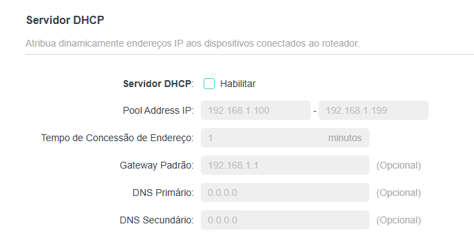

Figura 8 - Rede wifi configurada no tplink

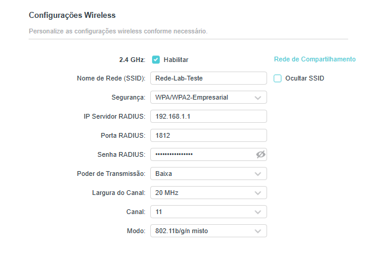

### Hardware

* TP-Link WR829N
* Adaptador USB Wi-Fi
* Notebook utilizado como plataforma de laboratório

O hardware físico utilizado neste projeto consiste em um notebook com uma interface de rede Ethernet (RJ-45) integrada, além de uma placa de rede USB Ethernet adicional.

No VirtualBox, a máquina virtual do pfSense foi configurada com duas interfaces de rede em modo bridge. A primeira interface foi associada à placa de rede integrada do notebook, sendo configurada como WAN, responsável pelo acesso à internet.

O modo Bridge foi utilizado para que o pfSense operasse como um dispositivo de rede real, integrado diretamente à infraestrutura física, permitindo comunicação direta com o ponto de acesso TP-Link e demais dispositivos da rede, simulando um ambiente de produção.

A segunda interface foi associada à placa de rede USB Ethernet, sendo configurada como LAN, onde foi conectado o ponto de acesso TP-Link.

Figura 8 - Configuração de rede no VirtualBox

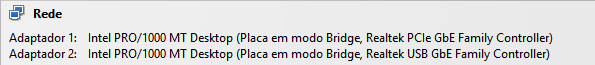

Figura 9 - tplink WR829N

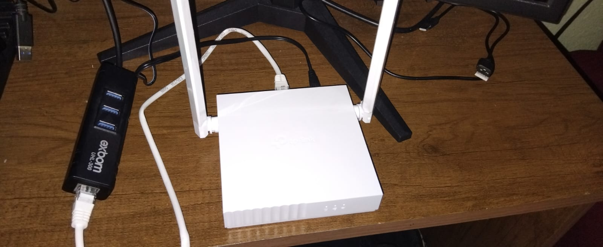

Figura 10 - Placa de rede usb conectada ao tplink

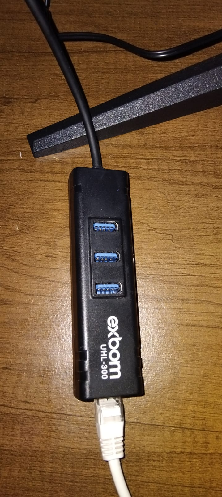

## Testes

Após a implementação da solução, foram realizados testes de autenticação utilizando os usuários user-teste1 e user-teste2, previamente cadastrados no servidor FreeRADIUS configurado no pfSense. Inicialmente, foi realizada a conexão do usuário user-teste1 por meio de um smartphone com sistema operacional Android. Em seguida, o usuário user-teste2 foi autenticado em um notebook com sistema operacional Windows. Ambos os testes foram concluídos com sucesso, comprovando o correto funcionamento da infraestrutura implementada e validando o processo de autenticação centralizada por meio do FreeRADIUS.

Figura 11 - Conectando user-teste1 a rede wifi em um dispositivo android

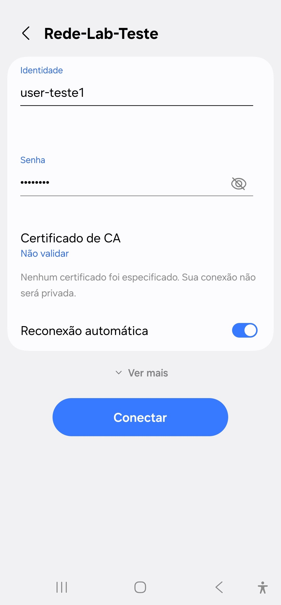

Figura 12 - user-teste1 conectado

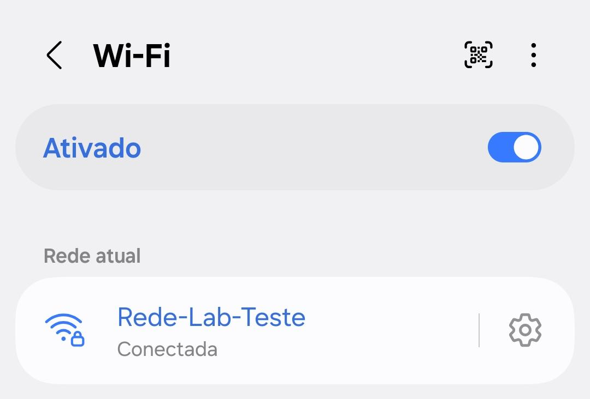

Figura 13 - Logs servidor freeRADIUS no pfSense user-teste1 autenticado

Figura 14 - Logs no tplink do user-teste1 conectado

Figura 15 - Conectando user-teste2 a rede wifi em um dispositivo windows

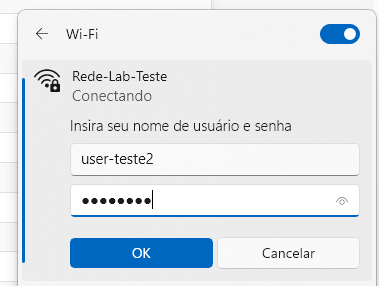

Figura 16 - user-teste2 conectado

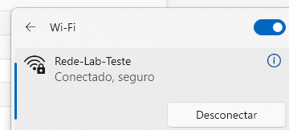

Figura 18 - Logs no tplink do user-teste2 conectado

Figura 18 - Logs no tplink do user-teste2 conectado

## Resultados

O ambiente foi configurado com sucesso, permitindo a autenticação centralizada de usuários em uma rede Wi-Fi através do protocolo WPA2-Enterprise.

O projeto demonstra a integração funcional entre pfSense, FreeRADIUS e um Access Point TP-Link, servindo como base para estudos de autenticação em redes sem fio.